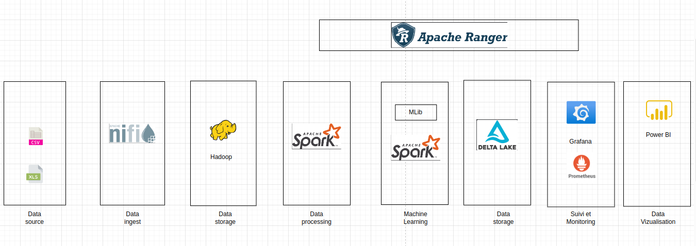

# projet_big_data

# lancement (dossier racine)

>docker network create projet_big_data_network

>bash_techno.bat ou bash_techno.sh

#important

Dans le nifi récupérer (clic droit) le templates du dossier racine (NIFIFLOW.xml)

Lancer les processors (en bas à gauche)

#lancement du projet avec spark

>bash_projet.bat ou bash_projet.sh

# prometheus et Grafana 

>Prometheus : http://localhost:9090/  
>Les jobs actifs sont dans targets  
>ils sont aussi accessible via ces adresses :  
>adresse_ip_du_container_prometheus:9090/metrics  
>adresse_ip_du_container_pushgateway:9091/metrics  
>adresse_ip_du_container_projet_big_data_python:8004/metrics  
>Grafana : http://localhost:3000/  
>Il faut peut-être mettre en place un data source prometheus :  
>grafana -> config -> data source -> prometheus -> URL : http://prometheus:9090/  
>Faire explore pour explorer les metriques  

Projet réalisé par Gaëtan ALLAH ASRA BADJINAN, Thomas MERCIER et Gabriello ZAFIFOMENDRAHA

