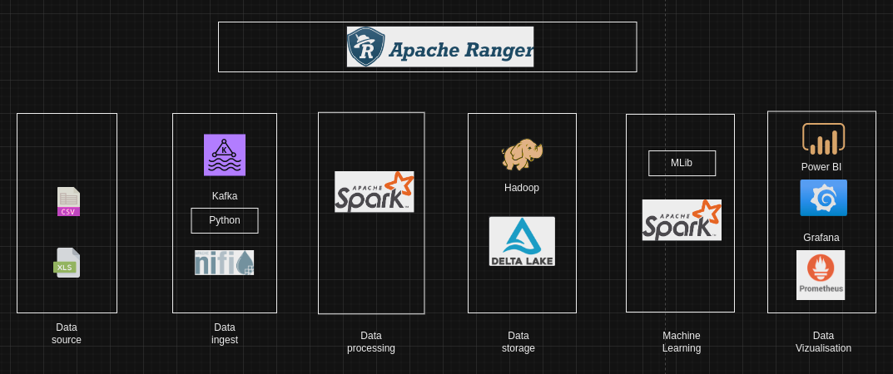
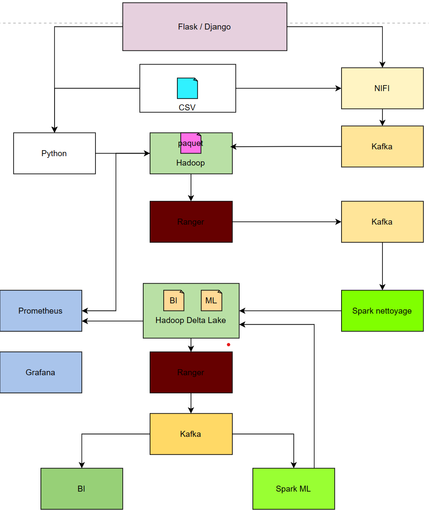

# projet_big_data

docker tags:

kafka : docker pull bitnami/kafka:3.4.1-debian-11-r95
Nifi : docker pull apache/nifi:1.23.2
Spark : docker pull spark:3.4.1-python3
Delta Lake : docker pull deltaio/delta-docker:0.8.1_2.3.0
Prometheus : docker pull bitnami/prometheus:2.47.0
Grafana : docker pull grafana/grafana:9.4.14
Apache Ranger : docker pull apache/ranger:2.4.0
Hadoop : https://github.com/ThomasMerci/docker-hadoop

# lancement 

docker network create projet_big_data_network

[aller dans hadoop pour lancer docker-compose]

[racine]
docker-compose build

docker-compose up

docker run projet_big_data
docker run --name nifi -p 8444:8444 -d apache/nifi:latest

# lancement 

