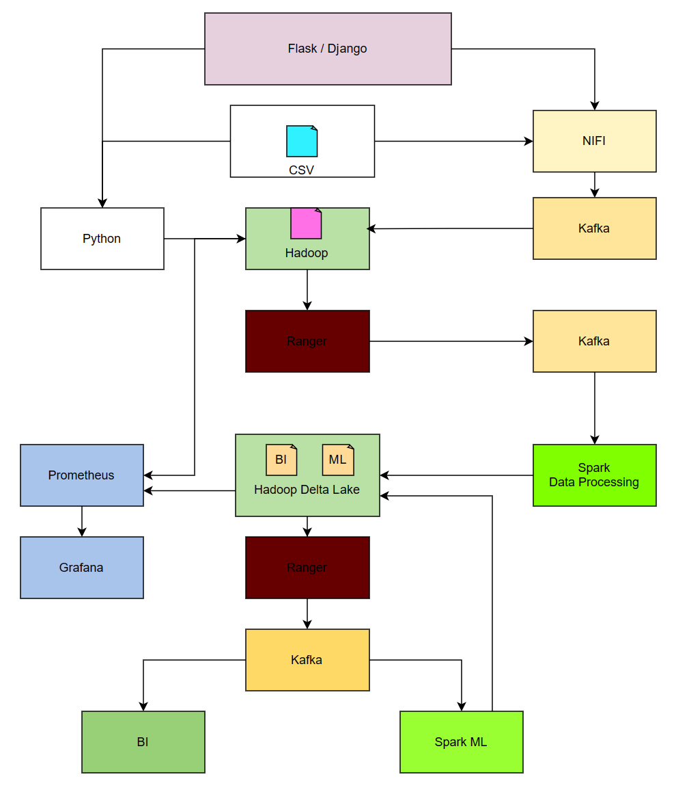

# projet_big_data

databricks:
https://databricks-prod-cloudfront.cloud.databricks.com/public/4027ec902e239c93eaaa8714f173bcfc/7526033782065205/2846754932110018/7851752974584711/latest.html

docker tags:

kafka : docker pull bitnami/kafka:3.4.1-debian-11-r95
Nifi : docker pull apache/nifi:1.23.2
Spark : docker pull spark:3.4.1-python3
Delta Lake : docker pull deltaio/delta-docker:0.8.1_2.3.0
Prometheus : docker pull bitnami/prometheus:2.47.0
Grafana : docker pull grafana/grafana:9.4.14
Apache Ranger : docker pull apache/ranger:2.4.0
Hadoop : https://github.com/ThomasMerci/docker-hadoop

# lancement 

docker network create projet_big_data_network

*[aller dans le dossier hadoop puis docker_hadoop_master]*
docker-compose up

*[aller dans le dossier techno]*
docker-compose up

*[dossier racine]*
docker-compose build

docker-compose up

